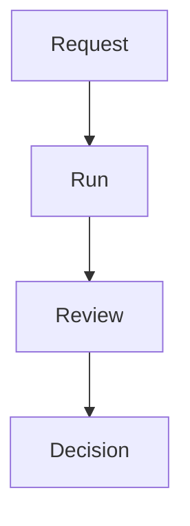

# Hobit Notebook / Notes Widget Contract

## Purpose

Notes is the current first-class widget/capability for operator text inside Hobit.

The future Notebook is the planned evolution of Notes into a practical text workbench surface with multiple text tabs/documents, Markdown source text, rendered Markdown and diagram previews, explicit text formatting tools, and optional AI-assisted editing that remains operator-approved.

Notes and Notebook give the operator a simple place to write, organize, transform, and resume freeform text without turning that text into structured Knowledge, Evidence, Runbooks, or agent memory by default.

## Product Role

- Notes provide freeform writing inside Hobit.
- Notebook extends Notes into a multi-document text work surface inside one widget.
- Notes can be global or workspace-local.
- Notes support lightweight memory, observations, snippets, manual notes, checklists, todos, review notes, Markdown writeups, simple diagrams, and scratch documentation.
- Notes are optional widgets/capabilities, not the product center.

## Current Implementation Boundary

The current implemented Notes widget is intentionally minimal:

- Notes is insertable from the Widget Catalog.
- Notes persists one widget-local draft body through `widget_instances.state`.
- The current state shape is:

```json
{ "body": "..." }
```

- Save and restore use the generic widget state path.
- Widget logs, layout editing, floating mode, and workspace activity are provided by the shared widget foundation.

Not implemented in the current Notes widget:

- multiple tabs or multiple documents inside one widget
- full Notebook data model
- folder or document storage
- Markdown preview
- Markdown rendering
- Mermaid or other diagram rendering
- edit/preview/split modes
- fenced block renderer system
- autosave beyond the current explicit state-save path
- text formatting or transformation tools
- checklist/todo structure beyond freeform text
- AI-assisted editing
- note search, tags, backlinks, import/export, or sync

This document is a future contract. It must not be read as implemented behavior.

## Naming

`Notes` is the current widget name and existing contract name. `Notebook` is the future product direction for the richer text work surface.

Future implementation may keep the visible widget name `Notes`, rename it to `Notebook`, or expose both through templates, but the state migration rules in this contract still apply to existing saved Notes widgets.

## Non-Goals

- Notes are not Knowledge Catalog.
- Notes are not Runbooks.
- Notes are not Evidence by default.
- Notes are not structured validated operational knowledge.
- Notes are not an agent memory system by default.
- Notes are not a replacement for Workspace event history.

## Scopes

### Global Notes

Global Notes are independent of any Workspace.

They are available across Workspaces and are useful for personal or common reference.

Examples:

- command cheat sheets
- personal DBA notes
- VICO endpoints
- design notes

### Workspace Notes

Workspace Notes are bound to one Workspace.

They are persisted as part of resumable Workspace state and are restored when the Workspace is reopened.

Workspace Notes are useful for task-local observations, hypotheses, manual notes, pasted snippets, and decisions-in-progress.

The same Notes Widget definition can be instantiated with different scope configuration:

- Notes Widget instance with `scope=global`
- Notes Widget instance with `scope=workspace`

## Data Model

### Current State

The current persisted widget state is the legacy single-body shape:

```json
{ "body": "..." }
```

This shape must remain readable by future Notebook implementations.

### Future Widget-Local Notebook State

The near-term Notebook model should support multiple text tabs/documents inside one widget instance.

Illustrative state shape, not implemented yet:

```json
{
  "activeTabId": "tab-1",
  "tabs": [
    {
      "id": "tab-1",
      "title": "Notes",
      "body": "..."
    }
  ]
}
```

Future fields may include:

- `version`
- tab ordering
- tab `createdAt` and `updatedAt`
- tab metadata
- dirty state
- editor selection or cursor state
- per-tab language or content hints

The first Notebook implementation should keep state small and explicit. It should not introduce shared document storage or schema changes unless that block explicitly asks for them.

Notebook source text remains the source of truth. Rendered Markdown, diagrams, JSON previews, tables, or other preview outputs should be derived from stored source text when displayed. Future implementations must not replace source text with rendered output as the durable state.

### Long-Term Note Model

Conceptual note model for future global/workspace document storage:

- `NoteFolder`: an organizational folder in a note tree.
- `NoteDocument`: a Markdown text document.
- `NotePath`: the resolved folder/document path within a note scope.
- `NoteScope`: global or workspace.
- `NoteContentMarkdown`: the Markdown storage/editing content.
- `NoteMetadata`: timestamps, authorship, tags, and optional links.

Conceptual fields:

- `id`
- `scope`
- `workspace_id` optional for workspace notes
- `folder_id` optional
- `title`
- `path`
- `markdown_content`
- `created_at`
- `updated_at`
- `created_by`
- `updated_by`
- `tags` optional
- `linked_workspace_objects` optional

The long-term folder/document model is separate from the near-term widget-local tab model. A future implementation must explicitly define when tab content becomes a shared `NoteDocument` instead of widget-local state.

## Legacy Compatibility

Future Notebook implementations must safely handle existing Notes state:

- `{ "body": "..." }` must remain readable.
- Existing saved Notes content must not be lost.
- Existing `body` text may be treated as plain text or Markdown source by future Notebook implementations.
- A future migration may adapt legacy state to one tab, for example `tabs[0].body = body`.
- Rendered Markdown, Mermaid diagrams, JSON previews, or other previews must be derived from source and must not replace the legacy body during migration.
- Migration must be explicit, tested, and reversible enough to diagnose failures.
- Unknown state fields must not be silently discarded.
- Invalid or unexpected state must fail conservatively, preserve the original stored value where possible, and show an understandable error or fallback.
- A migration must not rewrite all saved Notes merely because a widget was opened unless that behavior is explicitly designed and tested.

## Folder System

Notes support hierarchical folders.

Expected folder behavior:

- rename/move/delete folders
- move notes between folders within the same scope
- keep global and workspace folder trees separate
- do not silently move workspace notes into global notes or global notes into workspace notes

Cross-scope moves, copies, or links must be explicit operator actions.

## Markdown Editing

Markdown is the future storage and editing format for Notebook text.

Notebook may use Markdown for:

- operator notes
- checklists and todos
- structured writeups
- lightweight docs
- review notes
- pasted snippets
- simple diagrams through fenced blocks

Markdown support must not imply full rich-document editing in the first implementation. Source editing remains valid and a plain text editing fallback is acceptable.

The editor may support preview later. A plain text editing fallback is acceptable.

Embedded files/images are not required initially.

Backlinks and wiki-style links are future optional capabilities.

### Edit And Preview Modes

Future Notebook UI may support:

- Edit mode: shows source text.
- Preview mode: shows rendered Markdown and rendered blocks.
- Split mode: shows source and preview side by side.

The first implementation may choose a simpler Edit / Preview toggle. The current implementation remains a plain textarea with explicit Save and has no Markdown rendering, Preview mode, Split mode, or diagram rendering.

### Rendered Blocks

Rendered blocks are Markdown-adjacent preview output derived from explicit source text. They are not hidden transformations.

Future rendered block candidates include:

- Mermaid diagrams
- JSON preview or prettified JSON display
- code blocks
- SQL snippets
- checklists
- tables
- PlantUML later only after security review
- Graphviz DOT later only after security review

Rendered blocks must be opt-in through visible source syntax such as fenced code blocks. Rendering must not execute commands, mutate Notebook source, load remote assets by default, or contact the network.

### Mermaid Diagrams

Mermaid is the primary future diagram syntax for Notebook.

Mermaid diagrams should render only from explicit fenced code blocks using language `mermaid`.

Example syntax:

````markdown

````

Future Mermaid diagram families may include:

- `flowchart`
- `sequenceDiagram`
- `stateDiagram`
- `classDiagram`
- `erDiagram`
- `gantt` later if useful

Mermaid rendering rules:

- Rendering should be local and deterministic.
- Source text remains editable.
- Rendered diagrams are preview output, not persisted replacements for source.
- Rendering errors must not destroy source text.
- Invalid diagrams should show a clear error and preserve the original content.
- Rendering must not make hidden network calls.
- Rendering must not execute commands.
- Rendering must not load remote assets by default.
- Sanitization and security handling must be explicit when implemented.
- Preview output must not become an implicit action, agent command, or runtime execution path.

### JSON Blocks

Future Notebook may recognize fenced JSON blocks using language `json`.

JSON actions may later:

- prettify selected text
- prettify the active fenced JSON block
- show a rendered JSON preview

Invalid JSON must preserve original text and show a clear error. Notebook must not auto-format JSON on save, paste, or preview.

### Code Blocks And SQL Snippets

Code blocks are text and rendered snippets by default.

Rules:

- Code blocks must not execute from Notebook preview.
- Shell, PowerShell, Bash, SQL, and other command-like snippets must never run from preview.
- A future `run` action must be explicit, approval-gated, and routed through the proper execution widget or tool-action contract.
- Notebook preview must not become a terminal, SQL runner, script executor, or hidden automation path.

### Tables And Checklists

Markdown tables and checklists are useful Notebook content.

Checklist and todo use cases belong in Notebook by default, not a separate To-do List widget. Rendering a checklist must not imply task execution, Agent Queue behavior, Workspace Activity mutation, or background automation.

### PlantUML And Graphviz DOT

PlantUML and Graphviz DOT may be considered later, but they should not be implemented until the security and rendering model is reviewed.

They may require different runtime boundaries than Mermaid. This contract does not claim PlantUML or Graphviz DOT support exists.

## Notebook Tabs

Future Notebook should support multiple text tabs/documents inside one widget.

Notebook is the default home for operator-authored checklists, todos, snippets, review notes, and scratch planning text. A separate To-do List widget is redundant unless a future contract explicitly defines distinct structured task-management behavior that Notebook should not own.

Required tab operations:

- add text tab/document
- delete tab with confirmation or safe recovery behavior
- rename tab
- switch active tab
- preserve each tab's content independently

Future optional tab operations:

- duplicate tab
- reorder tabs
- pin or mark important tabs
- move a tab into a future global/workspace note document

Tab behavior rules:

- Switching tabs must not lose unsaved text.
- Deleting the active tab must choose a predictable next active tab.
- Empty-title tabs should receive a clear fallback title.
- The active tab should be persisted as `activeTabId` or equivalent state.
- Tab identity must be stable across renames.
- Tab content should remain plain text or Markdown unless a future content-type contract is added.

## Text Formatting And Transformation Actions

Notebook may provide explicit user-triggered formatting and transformation actions.

Initial candidate actions:

- JSON prettify / format
- JSON minify later if useful
- list prettify / normalize
- bullet list cleanup
- numbered list cleanup
- trim trailing spaces
- normalize indentation
- sort lines
- remove duplicate lines
- wrap or unwrap lines later if useful

Formatting rules:

- Markdown and diagram rendering is preview behavior. Formatting actions are explicit source-text transformations.
- No hidden automatic formatting.
- No formatting on save unless the operator explicitly invokes it.
- Actions apply to the active tab or selected text, depending on the future UI.
- The target scope must be visible before the action runs.
- Transformations must preserve content meaning.
- Formatting failures must preserve the original text.
- Destructive or ambiguous transformations should be conservative, previewed, or undoable.
- Widget-local logs may record that a formatting action ran, but logs must not become the primary undo mechanism.

### JSON Prettify

JSON prettify must be an explicit action selected by the operator.

Behavior:

- Apply to selected text when a selection exists, otherwise to the active tab body.
- Parse JSON before replacing text.
- If parsing fails, show an error and preserve the original text.
- Do not partially rewrite invalid JSON.
- Do not claim success when parsing or formatting failed.
- Do not automatically format JSON on paste or save.
- Do not automatically format JSON just because a JSON block is previewed.
- Prefer deterministic indentation and stable output.
- Reversibility should come through normal editor undo/local draft behavior when that exists.

### List Prettify

List prettify must be an explicit action selected by the operator.

Behavior:

- Normalize pasted lists into readable bullets, numbers, or line breaks.
- Preserve item text and meaning.
- Avoid aggressive guessing across prose paragraphs.
- Avoid destructive transformations such as dropping repeated content unless the operator selected a duplicate-removal action.
- Ambiguous transformations should be previewed, constrained to selected text, or skipped with an explanation.

## Widget Behavior

Notes Widget must follow the base widget contract:

- WidgetDefinition / WidgetInstance separation
- input/action/result lifecycle where relevant
- widget-local console/logs
- resize/reposition
- float in workspace / detach
- ghost placeholder
- optional always-on-top in future true external popout mode
- communicates through Workbench state/events, not direct coupling

## Actions

Future note/notebook actions may include:

- create folder
- rename folder
- delete folder
- create note
- rename note
- edit note
- move note
- delete note
- switch note
- save note
- search notes
- link note to Workspace object
- promote note fragment to Knowledge candidate
- attach note excerpt as Evidence candidate
- add tab
- delete tab
- rename tab
- switch active tab
- run explicit text formatting action

Promoting note content to Knowledge or Evidence must be an explicit operator action.

There is no automatic promotion.

## Agent Interaction

Agent interaction with notes is capability and context bound:

- Agent may read notes only when notes are in available context/capability.
- Global notes are not automatically sent to agent.
- Workspace notes are not automatically sent to agent unless included in context or exposed through widget/capability rules.
- Agent may propose note edits or summaries, but operator controls saving.
- Agent may propose "promote this note to Knowledge candidate" but must not do it silently.
- Notebook may later support `Ask Agent` or `Work with AI` actions inside the widget.
- AI may use the active tab, selected text, or explicitly allowed Workspace context only when that context is visible or reviewable.
- AI may propose Markdown, Mermaid diagrams, summaries, checklist cleanup, or formatting improvements.
- AI suggestions must be operator-approved before applying changes.
- AI must not silently rewrite notes, use hidden context, run commands, render unsafe content, or promote content to another capability.

Future Workspace-aware Coordinator Agent use of Notebook content must follow `docs/WORKSPACE_COORDINATOR_AGENT_CONTRACT.md`: approved Notebook context may support proposed Queue Items, summaries, follow-up blocks, or Notebook edits, but reading and applying changes must remain visible and operator-approved.

## UI Direction

Notebook UI should keep writing as the focus:

- Tabs should be lightweight and compact.
- The active writing area should remain the primary surface.
- Edit, Preview, and Split modes may be introduced later, but source text must remain easy to access.
- Rendering errors should be visible without blocking source editing.
- Formatting tools should not clutter the main writing surface.
- Tools may live in a small action menu, compact toolbar, or command menu.
- Destructive actions such as delete tab must require confirmation or a recovery path.
- Disabled or unavailable tools must not imply hidden automatic behavior.
- Notebook must remain inside the shared `WidgetFrame` and keep widget Logs, layout edit, floating mode, and future true popout behavior.

## Workspace And Widget Relationship

Notebook is a widget-local text work surface unless a future design explicitly introduces shared documents.

Rules:

- Notebook state remains widget state by default.
- Notebook must follow the base widget contract for persisted state, widget-local logs, layout editing, floating mode, ghost placeholder, and future true popout behavior.
- Notebook may later interact with Request Templates, Agent Chat, Git review, Knowledge, or Evidence through explicit user actions.
- Notebook must not directly couple to other widgets.
- Notebook must not silently share content across widget boundaries.
- Cross-widget use of Notebook content must be visible and operator-controlled.

## Safety Principles

- No hidden formatting.
- No hidden rendering side effects.
- No hidden AI rewriting.
- No hidden context use.
- No hidden network calls from rendered content.
- No script execution from Markdown or HTML.
- No automatic command execution from Notebook.
- No command execution from code blocks or diagram blocks.
- No destructive tab or document delete without confirmation or a recovery plan.
- Render failures must preserve the original text.
- Formatting failures must preserve the original text.
- Existing Notes data must remain readable.
- Source text remains the source of truth.
- Rendered diagrams and previews must be derived from source.
- Sanitization must be explicit when rendering is implemented.
- Transformations must be explicit and operator-controlled.
- AI edits require operator approval before applying changes.
- Unknown state must not be silently discarded.

## Persistence And Resume

Global notes persist independently.

Workspace notes persist with Workspace.

Workspace notes must be restored when Workspace is reopened.

Current active tab, selected folder, editor dirty state, and cursor/selection may be persisted as widget state if useful.

## Relationship To Other Concepts

### Notes vs Knowledge

Notes are freeform/operator-authored Markdown text. Knowledge is structured, reviewed, or validated context. Notes may be promoted to Knowledge candidates only through explicit operator action.

### Notes vs Evidence

Notes are not Evidence by default. A note excerpt may become an Evidence candidate only through explicit operator action.

### Notes vs Runbook

Notes may contain instructions or checklists, but they do not define executable or governed runbook behavior.

### Notes vs To-do List

Notebook absorbs normal checklist and todo use cases: Markdown checklists, lightweight task notes, follow-up lists, review checklists, snippets, and planning scratchpads belong in Notes/Notebook by default.

A separate To-do List widget should remain demoted unless a future block explicitly needs structured task-management behavior such as assignment, filtering, scheduling, external synchronization, or governed completion workflows. That future widget must not duplicate Notebook's freeform text responsibility.

### Notes vs Shared State

Notes are documents. Shared State is named structured state available to the Workbench and relevant widgets.

### Notes vs Event Log

Notes are operator-authored text. Event Log is the structured history of Workspace and Workbench events. Notes do not replace event history.

## Initial Implementation Direction

Initial implementation should be simple:

- preserve legacy `{ "body": "..." }` state
- migrate or adapt legacy state into one tab only when explicitly implemented
- widget-local text tabs/documents
- source Markdown remains the durable content
- rendered previews are derived and not stored as source of truth
- checklists, todos, snippets, and review notes as Notebook content
- compact tab UI
- optional simple Edit / Preview toggle later
- explicit formatting action menu
- no sync
- no collaborative editing
- no rich embedded media
- no hidden Markdown or diagram rendering side effects
- no automatic Knowledge ingestion
- no hidden AI rewriting
- no complex graph/backlinks

## Future Extensions

- search
- tags
- markdown preview
- Mermaid fenced-block rendering
- JSON preview
- code block presentation
- table and checklist rendering
- PlantUML or Graphviz DOT only after explicit security review
- backlinks
- templates
- note-to-knowledge review flow
- note-to-evidence attachment
- global/workspace folder storage
- export/import
- sync

## Non-Goals For The Current Repository

This contract does not implement:

- Notebook tabs
- Notebook state migration
- Notebook UI changes
- Markdown renderer
- Mermaid dependency or renderer
- rendered block system
- Preview mode or Split mode
- schema changes
- formatting engine
- JSON or list transformation code
- AI-assisted editing
- shared document storage
- copy/send behavior
- cross-widget automation
